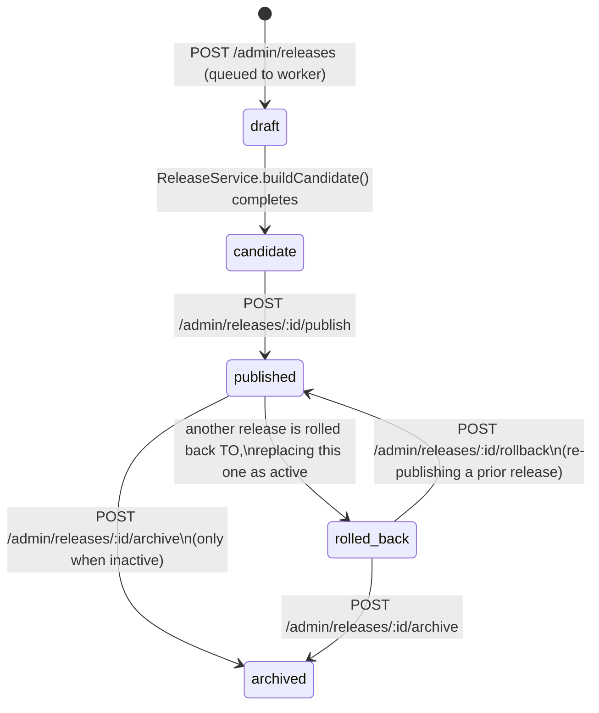

# Dataset Release Lifecycle (operational view)

Companion to ADR 0002 (the design rationale) and `docs/admin-operations.md`
(the endpoint-level guide). This is the state-machine view.

## What "publish" actually does

A single transaction, guarded by `pg_advisory_xact_lock`:

1. Clear `is_in_active_release` on every `food_versions` row.
2. Set it on every version referenced by this release's `release_items`.
3. Flip `dataset_releases.is_active` from the old release to the new one.

Public search/detail read `food_versions WHERE is_in_active_release` — a
single flat table scan, no join to `release_items` at request time. This is
why publish is fast (milliseconds to low seconds even for a large catalog)
regardless of how many releases have accumulated historically.

## What "rollback" actually does

Rollback is not a special mechanism — it's `publish()` called with a prior
release's id, plus marking the release it's replacing as `rolled_back`
instead of leaving it `published`. The same atomic flag-flip applies. There
is no data loss: the replaced release's `FoodVersion` rows are untouched
(they're shared, immutable, and referenced by `release_items` regardless of
which release is currently active).

## FoodVersion reuse

Building a candidate release checksums each verified food's flattened
payload (`buildFoodVersionPayload` → sha256). If a `FoodVersion` with that
exact checksum already exists for the food (from any prior release), it's
reused — no new row, no `versionNumber` increment. This means:

- Publishing/rolling back never duplicates storage for unchanged foods.
- `release_items.changeKind` (`added`/`changed`/`unchanged`) is computed by
  comparing against the *previously active* release's membership, giving
  the admin UI's compare view accurate diff counts for free.

## Snapshot integrity guarantee

Nothing in the release lifecycle ever touches `diary_entries` or
`recipe_ingredients` — their `nutritionSnapshot.source.foodVersionId` stays
pinned to whichever `FoodVersion` existed at logging time, even after that
version stops being the active one (or the release containing it is rolled
back or archived). See `docs/architecture/nutrition-snapshots.md` and the
`GATE:` integration test in `apps/api/test/consumption.integration.spec.ts`.
