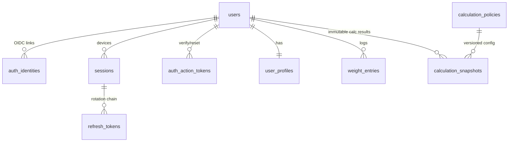
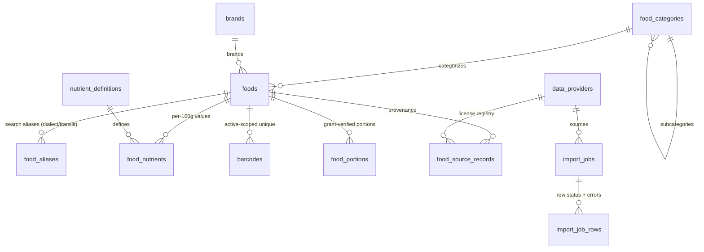
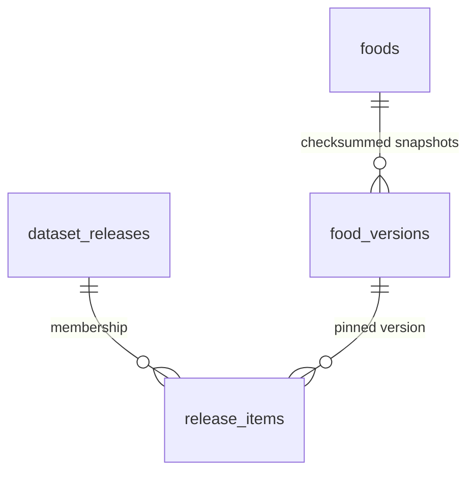
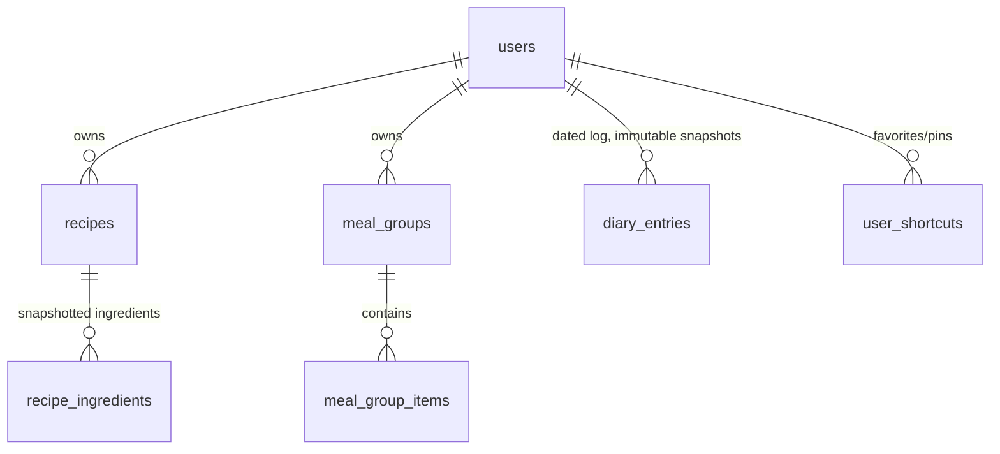
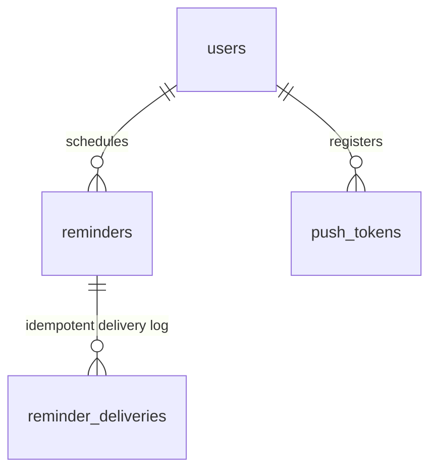

# Entity Relationship Diagram

Summary-level ERD of the Health House schema. The authoritative definition is
`packages/database/prisma/schema.prisma` plus the hand-written SQL in
`packages/database/prisma/migrations/*/migration.sql` (generated columns,
partial indexes, `normalize_arabic()`).

## Identity & profile

## Food catalog (editorial layer, mutable)

## Releases (immutable published layer)

The public API reads only `food_versions WHERE is_in_active_release` — a flat,
denormalized, search-indexed table. Publish/rollback flips that flag in one
advisory-locked transaction.

## Consumption

`recipe_ingredients.nutrition_snapshot` and `diary_entries.nutrition_snapshot`
are write-once JSONB pinned to a `food_version_id` — dataset updates never
change history.

## Reminders, audit, operations

Standalone tables: `audit_log` (append-only, trigger-enforced),
`outbox_events`, `idempotency_keys`, `media_assets`, `search_query_logs`.

## Cross-cutting conventions

- UUID PKs via `gen_random_uuid()`; `Decimal` for all nutrient/weight values.
- Soft delete (`deleted_at`) only where recovery/audit is required: users,
  foods, recipes, meal groups, diary entries, reminders.
- Optimistic concurrency (`row_version`) on admin-edited catalog tables.
- Normalized shadow columns (`*_norm`) are `GENERATED ALWAYS` from
  `normalize_arabic()` — never written by application code.
